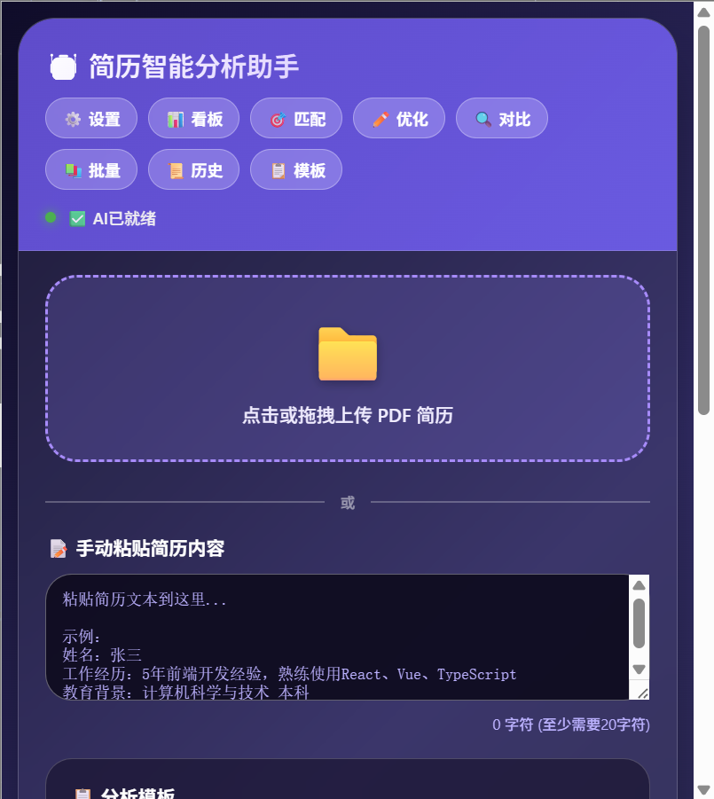
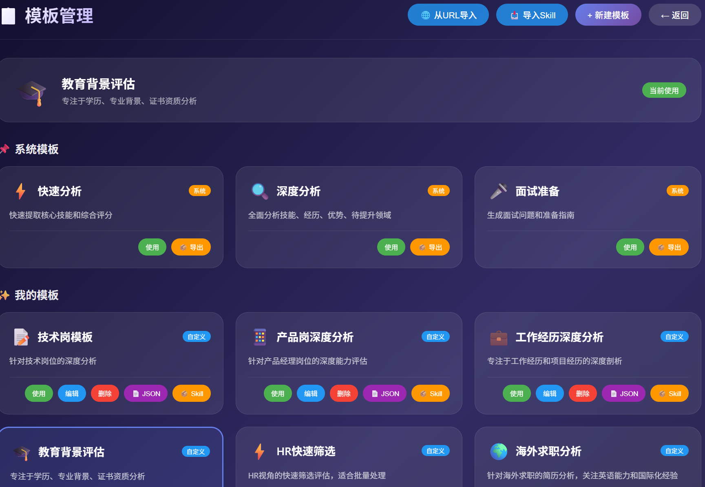
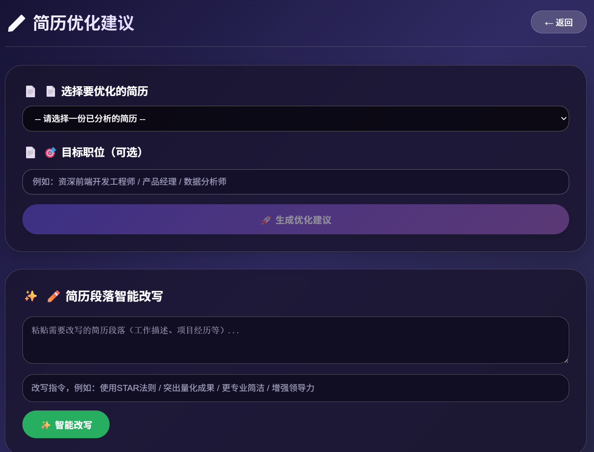
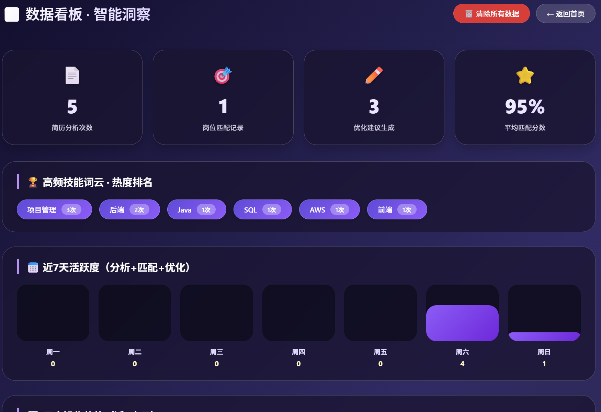

<div align="center">
  
  <h1>📄 本地简历智能分析助手</h1>
  <p><strong>Local Resume AI Agent - Chrome Extension</strong></p>
  <p>基于Chrome扩展的本地AI简历分析工具 | 隐私优先 | 支持DeepSeek/OpenAI | 可自定义Skill模板</p>


  <p>
    <a href="#-功能特点">功能特点</a> •
    <a href="#-快速开始">快速开始</a> •
    <a href="#-项目结构">项目结构</a> •
    <a href="#-技术架构">技术架构</a> •
    <a href="#-使用指南">使用指南</a> •
    <a href="#-配置说明">配置说明</a> •
    <a href="#-自定义模板">自定义模板</a> •
    <a href="#-开源协议">开源协议</a>
  </p>


  <p>
    
    
    
    
  </p>

</div>

---

## ✨ 功能特点

### 核心功能

| 功能           | 说明                                   |
| -------------- | -------------------------------------- |
| 📄 **简历分析** | 支持PDF上传和手动输入，多维度智能分析  |
| 🎯 **岗位匹配** | 粘贴JD，AI分析匹配度，生成面试指南     |
| ✏️ **简历优化** | 生成优化建议，支持段落智能改写         |
| 🔍 **报告对比** | 对比两份简历分析报告，直观展示差异     |
| 📚 **批量分析** | 一次性分析多份简历，进度跟踪，结果汇总 |
| 📊 **数据看板** | 统计图表、高频技能、活跃度分析         |

### 特色功能

| 功能                 | 说明                                        |
| -------------------- | ------------------------------------------- |
| 🎨 **自定义模板**     | 用户可创建自己的分析模板，适应不同行业/岗位 |
| 📦 **Skill导入/导出** | 支持从文件或URL导入Skill，兼容OpenClaw规范  |
| 🔒 **隐私保护**       | 所有数据在本地处理，不上传任何服务器        |
| 🌐 **多模型支持**     | 支持DeepSeek、OpenAI及兼容接口              |
| 📜 **历史记录**       | 保存所有分析记录，支持导出Markdown/TXT      |

---

## 📸 功能预览

| 主界面                          | 模板管理                               |
| ------------------------------- | -------------------------------------- |
|  |  |

| 岗位匹配                               | 数据看板                               |
| -------------------------------------- | -------------------------------------- |
|  |  |

---

## 🚀 快速开始

### 安装方式一：开发者模式安装

**1. 下载代码**

```bash
git clone https://github.com/yoontonlia/local-resume-agent.git
cd local-resume-agent
```

---

**2. 加载到Chrome**

- 打开 Chrome 浏览器，访问 `chrome://extensions/`
- 开启右上角的 **开发者模式**
- 点击 **加载已解压的扩展程序**
- 选择项目文件夹 `local-resume-agent`

**3. 配置API Key**

- 点击插件图标 → 点击 **⚙️ 设置**
- 选择模型提供商（推荐 DeepSeek）
- 输入 API Key
- 点击保存并测试连接

**4. 开始使用**

- 上传PDF简历或手动粘贴内容
- 选择分析模板
- 点击开始分析

### 安装方式二：Chrome应用商店（待发布）

> 正在审核中，敬请期待...

## 📁 项目结构

local-resume-agent/
├── icons/                      # 图标文件
├── lib/                        # 核心库
│   ├── llm-service.js          # 大模型服务
│   ├── ai-core.js              # AI核心
│   ├── template-manager.js     # 模板管理器
│   ├── skill-loader.js         # Skill加载器
│   ├── pdf-reader.js           # PDF读取
│   ├── web-extractor.js        # 网页提取
│   ├── report-exporter.js      # 报告导出
│   ├── history-manager.js      # 历史管理
│   ├── batch-analyzer.js       # 批量分析
│   ├── report-comparer.js      # 报告对比
│   ├── resume-optimizer.js     # 简历优化
│   ├── job-matcher-enhanced.js # 岗位匹配增强
│   └── data-stats.js           # 数据统计
├── skills/                     # 技能模块
│   ├── resume-analyzer.js      # 简历分析
│   └── job-matcher.js          # 岗位匹配
├── popup.html/js               # 主界面
├── settings.html/js            # API配置
├── templates.html/js           # 模板管理
├── history.html/js             # 历史记录
├── batch.html/js               # 批量分析
├── compare.html/js             # 报告对比
├── optimize.html/js            # 简历优化
├── job-match.html/js           # 岗位匹配
├── dashboard.html/js           # 数据看板
├── background.js               # 后台服务
└── manifest.json               # 插件配置

## 🛠️ 技术架构

### 核心技术栈

| 技术                         | 说明                 |
| :--------------------------- | :------------------- |
| Chrome Extension Manifest V3 | Chrome扩展框架       |
| 原生 JavaScript              | 无框架依赖，轻量高效 |
| DeepSeek/OpenAI API          | 大语言模型接口       |
| PDF.js                       | PDF文件解析          |

### 架构特点

- **模块化设计**：各功能独立，易于扩展和维护
- **模板系统**：用户可自定义分析模板，适应不同场景
- **Skill机制**：支持导入/导出Skill，兼容OpenClaw规范
- **本地优先**：所有数据存储在用户本地，不上传服务器

### 数据流向

用户输入(简历/JD) → AI核心 → 模板管理器 → 大模型API → 结构化输出 → 本地存储

## 📖 使用指南

### 1. 简历分析

**操作步骤：**

1. 点击上传区域选择PDF文件，或手动粘贴简历文本
2. 在下拉框中选择分析模板（系统模板或自定义模板）
3. 点击"开始分析简历"按钮
4. 等待AI分析完成，查看结果
5. 可导出分析报告（Markdown/TXT格式）

**支持的分析深度：**

- 快速分析：提取核心技能和综合评分
- 深度分析：全面分析技能、经历、优势、待提升领域
- 面试准备：生成面试问题和准备指南
- 自定义模板：用户自己定义的分析维度

### 2. 岗位匹配

**操作步骤：**

1. 先从历史记录中选择一份已分析的简历
2. 粘贴职位描述到文本框
3. 可选：点击"从当前网页提取"自动抓取JD
4. 点击"开始匹配分析"
5. 查看匹配度评分和面试建议

**输出内容：**

- 匹配度总览（多维度星级评分）
- 匹配优势分析
- 差距分析
- 简历优化建议
- 面试准备指南

### 3. 模板管理

**操作步骤：**

1. 点击主界面的"📋 模板"按钮
2. 查看系统模板和自定义模板
3. 点击"新建模板"创建自定义模板
4. 点击"导入Skill"从`.md`文件导入
5. 点击"从URL导入"从远程地址导入

**模板自定义：**

- 模板名称：自定义标识
- 系统提示词：定义AI角色
- 用户提示词模板：定义分析维度和输出格式
- 必须包含 `{resumeText}` 占位符

### 4. 批量分析

**操作步骤：**

1. 点击主界面的"📚 批量分析"按钮
2. 点击上传区域选择多个PDF文件
3. 选择分析深度
4. 点击"开始批量分析"
5. 查看进度和结果汇总
6. 可导出完整报告

### 5. 数据看板

**操作步骤：**

1. 点击主界面的"📊 看板"按钮
2. 查看统计卡片（分析总数、匹配次数等）
3. 查看高频技能标签
4. 查看周活跃度和月度趋势
5. 查看匹配度分布
6. 点击"刷新数据"更新统计

### 6. 历史记录

**操作步骤：**

1. 点击主界面的"📜 历史"按钮
2. 查看所有分析记录（按时间排序）
3. 点击记录查看详情
4. 可删除单条记录或清空全部
5. 可导出历史记录为JSON或Markdown

------

## ⚙️ 配置说明

### DeepSeek API Key 获取

1. 访问 [DeepSeek开放平台](https://platform.deepseek.com/)
2. 注册/登录账号
3. 进入"API Keys"页面
4. 创建新的API Key
5. 复制保存（只显示一次）

### OpenAI API Key 获取

1. 访问 [OpenAI Platform](https://platform.openai.com/)
2. 注册/登录账号
3. 进入"API Keys"页面
4. 创建新的API Key

### 配置步骤

1. 点击插件图标 → ⚙️ 设置
2. 选择模型提供商（DeepSeek/OpenAI/自定义）
3. 粘贴API Key
4. 可选：填写自定义模型名称
5. 点击保存配置
6. 点击测试连接验证

------

## 🎨 自定义模板

### 模板格式说明

用户提示词模板的唯一要求是：**必须包含 `{resumeText}` 作为简历内容占位符**。

其他内容完全自由，用户可以根据需求任意定义分析维度、输出格式、模块名称。

### SKILL.md 格式示例

markdown

```
---
name: 技术岗深度分析
icon: 💻
description: 针对技术岗位的深度能力评估
version: 1.0.0
author: 你的名字
tags: 技术, 研发, 代码
---

## 分析维度

请从以下维度分析简历：

1. **技术栈匹配度**：核心技能与岗位契合程度
2. **项目复杂度**：项目规模、技术难点
3. **代码质量**：代码规范、工程化能力

## 输出格式

### 综合评分
- 技术能力：X/10
- 项目经验：X/10

### 核心优势
1. 
2. 
3. 

【简历内容】
{resumeText}
```


### 自定义场景示例

| 场景       | 模板名称       | 分析重点                       |
| :--------- | :------------- | :----------------------------- |
| 技术岗招聘 | 技术岗深度分析 | 技术栈、项目复杂度、代码质量   |
| 产品岗招聘 | 产品岗深度分析 | 用户洞察、数据分析、项目管理   |
| 管理岗招聘 | 管理岗评估     | 团队规模、决策能力、人才培养   |
| 海外求职   | 海外求职分析   | 英语能力、国际化经验、签证适配 |
| HR筛选     | 快速筛选       | 硬性条件、关键亮点、面试建议   |

------

## 🤝 贡献指南

欢迎贡献代码、报告问题或提出建议！

1. Fork 本项目
2. 创建你的功能分支 (`git checkout -b feature/AmazingFeature`)
3. 提交修改 (`git commit -m 'Add some AmazingFeature'`)
4. 推送到分支 (`git push origin feature/AmazingFeature`)
5. 打开 Pull Request

------

## 📄 开源协议

本项目采用 MIT 许可证 - 详见 [LICENSE](https://license/) 文件

------

## 📧 联系方式

- 项目地址：[GitHub](https://github.com/yoontonlia/local-resume-agent)
- 问题反馈：[Issues](https://github.com/yoontonlia/local-resume-agent/issues)

------

## 🙏 致谢

- [DeepSeek](https://deepseek.com/) - 提供大模型API
- [OpenAI](https://openai.com/) - 提供大模型API
- [PDF.js](https://mozilla.github.io/pdf.js/) - PDF解析库
- Chrome 团队 - 提供扩展API

------

<div align="center"> <sub>Built with ❤️ for better job hunting</sub> <br> <sub>如果这个项目对你有帮助，请给个 Star ⭐</sub> </div>

------

